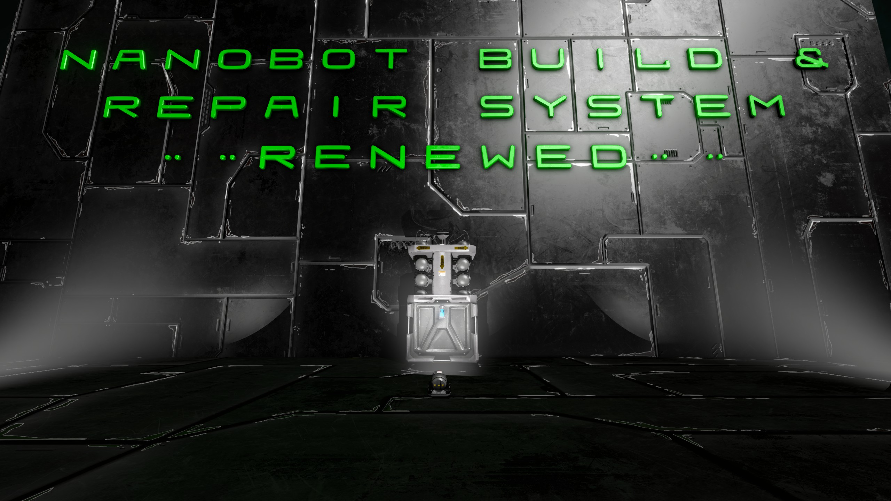

This is an updated version of the Nanobot Build and Repair System for Space Engineers, designed to be much more friendly for servers while still working for single player worlds. Back-end enhancements will be prioritized over other features, as this is working to be efficient for servers.

## Current Changes:
+ Gutted the Grinding/Welding VFX. They used the Interlock class for atomically setting variables which causes slowdowns as separate threads wait to modify the same variable. Audio is relocated within the code and working as expected.

## Planned Efficiency Changes:
+ When a block needs to be placed, for example from a projection, and has not been placed yet, Paste the block in, instead of welding. This should decrease cpu cycles incurred by the mod separating placing and welding.
+ Explore a sleep mode, if it doesnt already exist, where the block does almost nothing when no players are around, or are disconnected.
+ Reduce code complexity to identify more ways to save server resources.

## Potential Gameplay Changes:
+ New models/Textures.
+ More Conveyer connections.
+ Reducing the number of textures and Removing the colored status textures will reduce code, complexity, and resources from a feature that doesnt seem to be used much.
+ Increased power usage. The original mod uses a very small amount of energy, for a block which does quite a lot.
+ Adjustable power usage by the player, to improve speed, this replaces the effect of using multiple BaRs, increasing performance by using less blocks for the same effect. Only one block would be performing checks, etc.
+ Add new block(s) with less complexity/features, that still accomplish essential tasks, such as a walk mode only version that is intended only for repairing. The server limit on these blocks could be higher than the original block (or be used concurrently with the original) to be used as a strategy in battles, becuase of even fewer server resources being used. Maybe even a passive and active mode, passive just repairs, and active will replace blocks lost.
+ Checking for safezones/shields when grinding.
+ Add the Drill and Fill system, with similar tweaks for performance.
+ Maybe a player refill beam? heals the player and refills O2/H2 and energy.
+ Change the block base type to cut down on vanilla code running in the background, and only use custom super efficient.